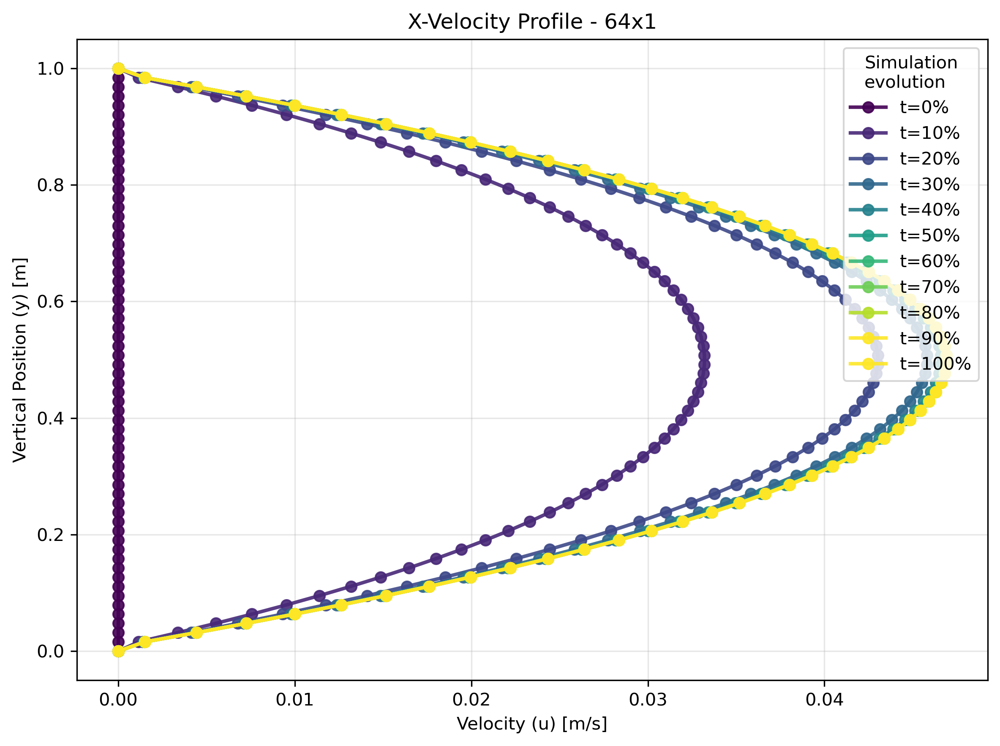
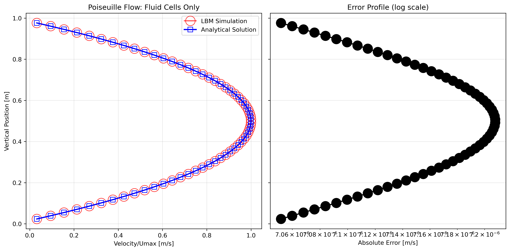
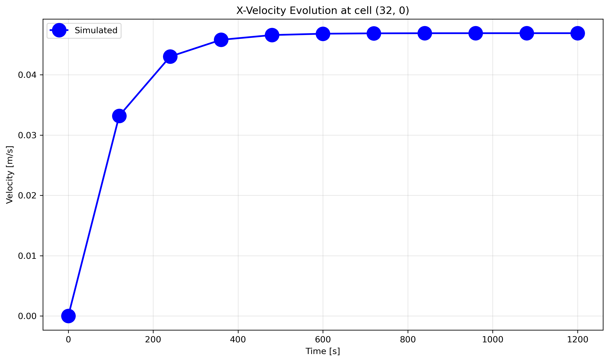
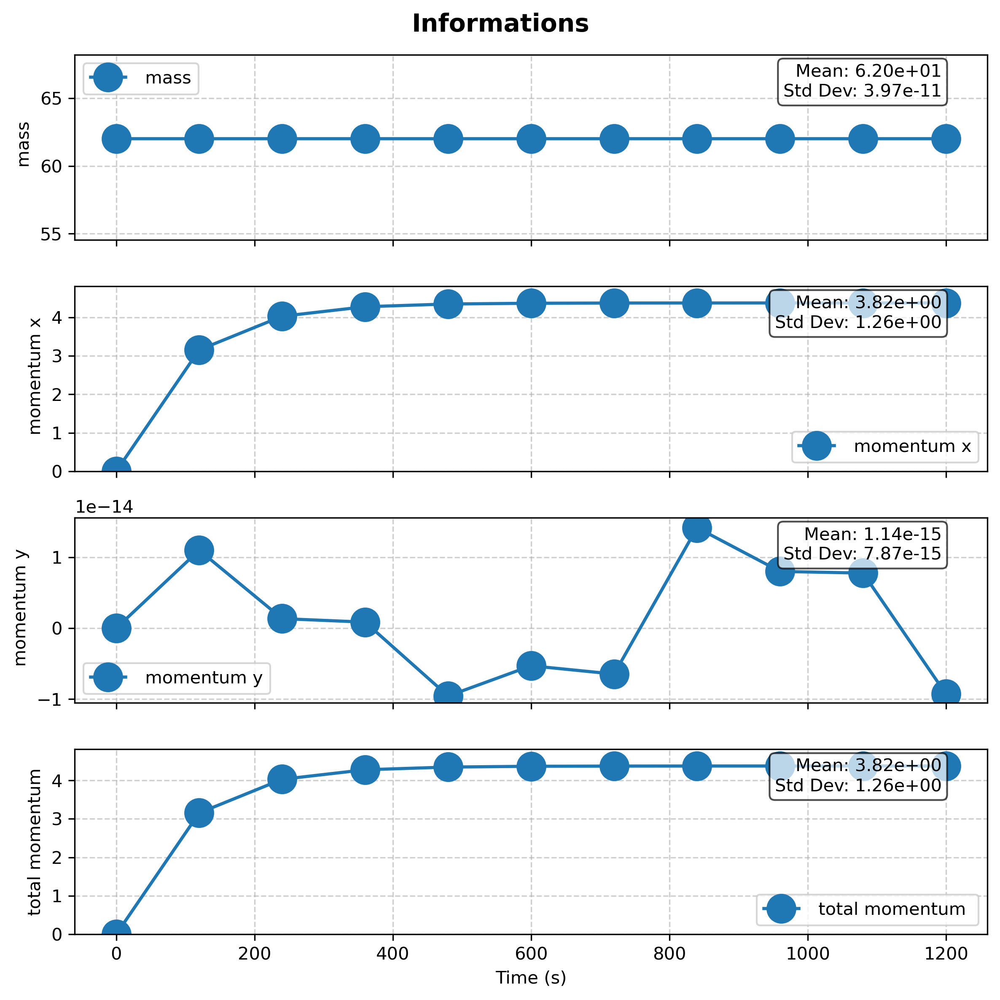
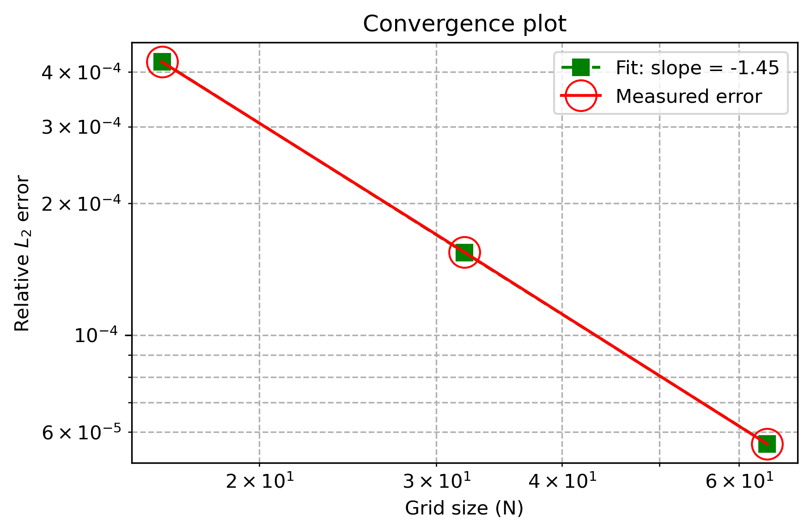

# LBM_BGK_D2Q9: A Lattice Boltzmann Method Solver

This project implements a 2D Lattice Boltzmann Method (LBM) solver using the Bhatnagar-Gross-Krook (BGK) approximation. The solver is designed for fluid dynamics simulations, providing a framework to model fluid flow, diffusion, and interactions with solid boundaries.

## Features

* **Lattice Boltzmann Method (LBM):** Utilizes the D2Q9 model, which represents fluid particles on a 2D grid with nine possible directions of movement: center, top, bottom, left, right and main diagonals.

* **Bhatnagar-Gross-Krook (BGK) Approximation:** Employs the BGK collision operator for simplified particle distribution relaxation.

* **Dimensional Scaling:** The class incorporates a diffusion scaling approach, named `Diffusion_Scalling` that receives: Physical length of domain, Characteristic diameter (Typically equal to length domain),  domain size in number of nodes, characteristic physical velocity, physical viscosity and total physical time. This allows for a systematic study of the method's behavior across different grid resolutions. Also, the code includes a loop to run simulations at various scales, defined by `dim_base` and `n_scales`. 

* **Boundary Conditions:**

    * **Periodic Boundary Conditions:** Applied to the x-direction (`dim_x = 1`) to simulate flow in a channel, where particles leaving one side re-enter on the opposite side.

    * **Solid Matrix Boundaries:** Implemented using a "halfway bounce-back" scheme for handling fluid-solid interactions. The `solid_matrix` defines the geometry of the domain, with `0.0` representing solid nodes and `1.0` representing void (fluid) nodes. This condition is explicitly applied to the top and bottom boundaries.

* **Macroscopic Property Calculations:** The solver calculates and updates macroscopic quantities such as density, momentum, and velocity at each timestep based on the microscopic particle distributions.

* **Data Export:** The code provides functionality to save simulation data to CSV files, including velocity fields (`_X.csv`, `_Y.csv`), the solid domain (`_solid.csv`), and global properties like total mass and momentum over time (`_infos.csv`).

* **Initial Conditions:** The simulation is initialized with a velocity field and density. By default these matrixes are set to zero or must be defined before calling `run` method. The equilibrium distribution functions are set to match these initial macroscopic properties. The class provides `initialize_velocity_field_Uniform` to initilize velocity fields with a constant.

* **Force Field:** A constant acceleration field (`acc_x` and `acc_y`) can be applied in the y and x-directions to drive the flow. By default, both are set to zero.

## Simulation Parameters

The simulation is configured through a set of physical and simulation parameters in the `main` function, including:

* **Physical:**

    * `visc`: Physical viscosity of the fluid.

    * `D`: Characteristic length.

    * `L`: Domain length.

    * `u0`: Characteristic velocity.

* **Simulation:**

    * `solid_matrix`: Solid cells must be set to 0.0, and void/fluid cells must be set to 1.0. By default all cells are void/fluid.
      
    * `T_real`: Total real-time duration of the simulation.

    * `dim_base`: Base resolution of the grid.

    * `n_scales`: Number of scaling levels to test.
  

---

## Tested Case: Poiseuille Flow

The C++ code is designed to simulate **Poiseuille flow**, a classic fluid dynamics problem involving the laminar flow of a fluid through a channel. This simulation models the flow driven by a constant force field between two stationary walls. The solver's ability to accurately reproduce the known parabolic velocity profile of this flow provides a critical validation of the implementation.

### Python Analysis (`LBM_Plotter_ATV2.py`)

The companion Python script is used for post-processing the simulation data. It provides a suite of tools to analyze the results and verify the accuracy of the solver.

* **`process_csv`**: A utility function for loading and parsing the raw CSV data from the C++ output.

* **`plot_vertical_velocity_profile`**: Visualizes the development of the velocity profile over time, showing the transition from the initial state to the final steady-state.

* **`compare_to_analytical`**: Compares the final simulated velocity profile against the **analytical solution** for Poiseuille flow and calculates the $L_2$ **error** to quantify the simulation's accuracy.

* **`scale_error_convergence`**: Analyzes the relationship between the grid resolution and the simulation error, plotting the convergence rate of the solver.

* **`plot_infos`**: Plots scalar values like mass and momentum over time, which is useful for checking the stability and conservation properties of the simulation.

### Graphics

The plots generated by the Python script are essential for visualizing the simulation's results. The following are examples of how you can include them in your `README.md`.

#### Velocity Profile over time

This plot shows how the velocity profile of the fluid evolves over time, developing from a uniform flow into the characteristic parabolic profile of Poiseuille flow.

#### Steady-State profile compared to analytical

This graph illustrate the accuracy of the solver compared to analytical solutions.

#### Cell Velocity

This graph helps to assess the stability of the simulation by showing the velocity of a single cell as it reaches a steady state.

#### Macroscopic Properties 

This graph is used to check the conservation of mass and momentum throughout the simulation, which are key indicators of a stable and correct LBM implementation.

#### Convergence across Scales

This plot demonstrates the accuracy of the LBM solver. It shows the relationship between the grid resolution and the relative $L_2$ error, confirming that as the grid size increases, the error decreases, indicating a stable and converging simulation.

## Usage

Compiling and Running C++
Use a C++ compiler like g++ to compile the source file.

`g++ -std=c++11 -O3 -o lbm_solver main_Atv2.cpp`

Then, execute the compiled program.

`./lbm_solver`

This will run the simulation and generate the necessary CSV data files in the output directory.

Running Python Analysis
Once the simulation data is generated, you can run the Python script to create the plots.

`python LBM_Plotter_ATV2.py`

This will read the CSV files and save the generated plots as images
